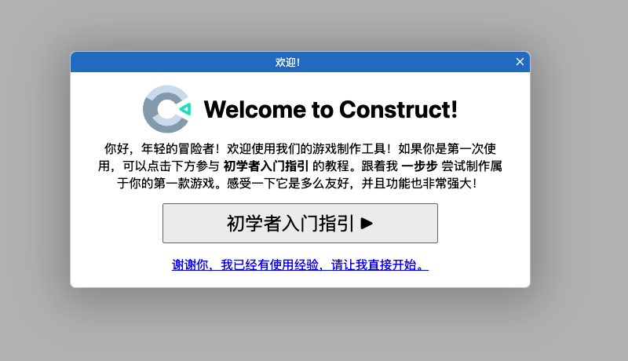
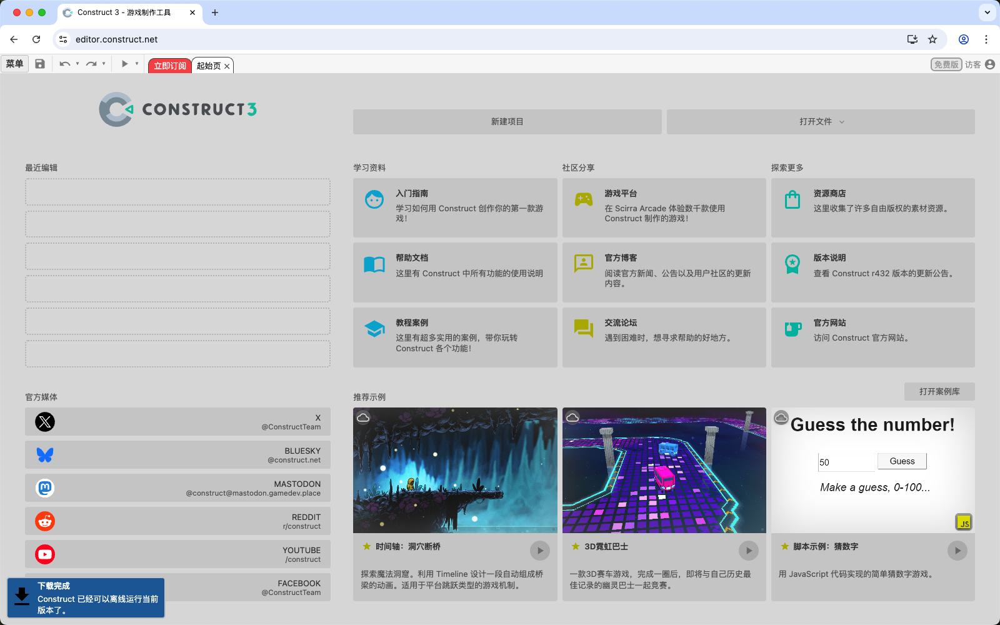
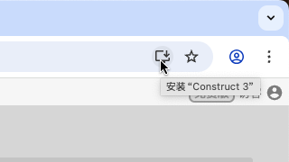
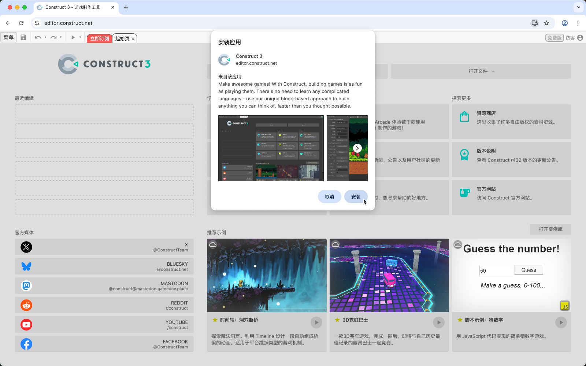
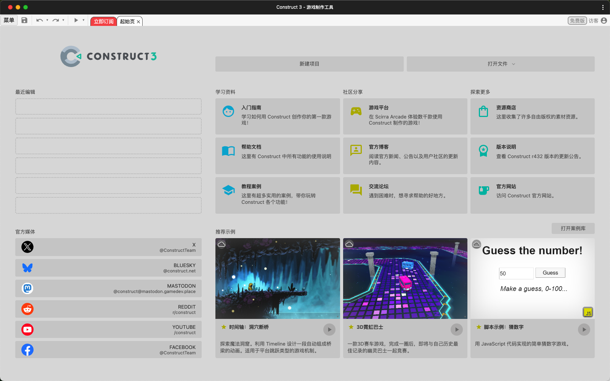
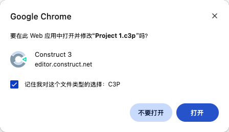

# Construct, 启动！

首先第一步，在浏览器打开 [Construct 3](https://www.construct.net/a/260259?t=construct3) 编辑器。

首次进入时，编辑器会推荐你进入 「初学者入门指引」 的互动教程。不要急着关闭它～ 强烈推荐你跟着教程走一次，可以帮助你以最直接的方式了解到 Construct 的工作方式。

当然，如果手快点击了关闭也没关系，你可以随时从菜单中再次启动它。

<figure><figcaption></figcaption></figure>

### 关于离线版

当第一次打开 Construct 编辑器时，它会自动在后台保存离线版本，随后左下角会出现一条提示：离线版本下载完成，之后即使可以在没有网络的环境下也可以正常使用。

建议在首次联网状态时预览一次游戏项目，以确保预览窗口也能保持在离线状态运行。部分浏览器可能会因为存储权限设置阻止离线缓存。

注意，如果购买了订阅，必须至少 7 天内再次联网一次，验证账号权限。否则将只能停留在免费版。(但是，你可以在离线状态下，永久使用免费版)

<figure><figcaption></figcaption></figure>

### 关于桌面版

Construct 3 是一款完全基于浏览器运行的游戏引擎。你可以通过浏览器提供的安装应用 / iOS 添加到主屏幕的功能，安装为应用程序来使用它。

<figure><figcaption></figcaption></figure>

在地址栏右侧会看到一个安装图标，点击后，会弹出这样的提示，点击 "安装" 选项。

<figure><figcaption></figcaption></figure>

安装完成后，桌面上会创建一个 Construct 3 的应用程序图标，双击即可打开编辑器。

<figure><figcaption></figcaption></figure>

Construct 3 的项目文件通常以 .c3p 格式保存，安装桌面应用后，你可以双击打开 .c3p 文件，就可以直接在编辑器打开项目了。

首次打开时，会弹出一个窗口询问你是否关联 .c3p 项目文件的打开方式。请选择 "打开"

<figure><figcaption></figcaption></figure>

### 其他注意事项

请注意：

**不要在浏览器的无痕模式、隐身模式、隐私访问环境使用**。在此模式下，浏览器可能无法获得本地储存的权限，导致你的项目文件无法正常保存。

**不要在微信、QQ等应用内置的浏览器直接打开。**&#x5982;果你是通过聊天窗口点击链接访问的，请复制链接到浏览器再打开。推荐使用谷歌浏览器(包括Mac用户)。内嵌的浏览器可能因为没有访问本地储存的功能权限，导致你的项目文件无法正常保存。\
\
如果你还没有安装谷歌浏览器，请不要通过电脑管家的软件中心安装（他们提供的版本通常比较旧）。请访问 **Chrome 官网** ([https://google.cn/intl/zh-CN/chrome/](https://link.zhihu.com/?target=https%3A//google.cn/intl/zh-CN/chrome/)) 下载安装，无需科学上网。

对于使用国产浏览器的用户（如：360、QQ、搜狗、百度、UC、夸克、2345、猎豹、遨游....），强烈建议你更换至谷歌浏览器，避免因为 Chromium 版本过低导致出现各种兼容性问题。\
\
如果你已经安装了谷歌浏览器，请检查版本是否有更新。请务必定期更新浏览器至最新版本，可以减少许多已经被解决的问题出现。检查版本更新的方式是：在右上角按钮展开菜单，帮助 -> 关于 Google Chrome。

请放心，升级浏览器不会导致电脑变卡，反而会为你解决许多奇奇怪怪的BUG。

#### 收藏网址 

注意，有些同学是从官网点击 'Launch the Guided Tour' 按钮进入的 Construct 编辑器，此链接自带了从新手教程的跳转方式 (<mark style="color:blue;">https://editor.construct.net/</mark><mark style="background-color:yellow;">**?startTour**</mark>)。于是每当你从地址栏的历史记录进入时，都会从新手教程开始。

因此正确的做法是，去掉后面的参数。请收藏这个链接:\
[https://editor.construct.net/](https://editor.construct.net/)&#x20;

#### 有用的链接 

这里推荐一些常用的链接，方便某一天你进来找到它们：

### 编辑器版本

对于大多数用户，只需要访问稳定版就可以了，这适合绝大部分的用户。

* <mark style="background-color:yellow;">Construct 3 Stable</mark> (稳定版, 每月更新)\
  [https://editor.construct.net/](https://editor.construct.net/)
* Construct 3 Beta (测试版，每周二更新)\
  [https://editor.construct.net/beta](https://editor.construct.net/beta)
* Construct 3 LTS (长期支持版，每年更新)\
  [https://editor.construct.net/lts](https://editor.construct.net/lts)

测试版：如果你喜欢更早体验新功能，愿意帮助官方进行功能测试，积极提交反馈建议。欢迎你使用测试版。但是要注意，请避免在制作正式项目时使用测试版，因为测试版通常没有经过全面的测试，随时可能会崩溃，稍不注意将导致进度丢失。

长期支持版：LTS 版本适合一些正在开发中大型项目的团队，共同约定停留某个版本，尽可能减少因版本更新带来的风险。

### 文档手册 

* <mark style="background-color:yellow;">表达式手册</mark>\
  [https://www.construct.net/en/make-games/manuals/construct-3/system-reference/system-expressions](https://www.construct.net/en/make-games/manuals/construct-3/system-reference/system-expressions)
* 快捷键列表\
  [https://www.construct.net/en/make-games/manuals/construct-3/interface/keyboard-shortcuts](https://www.construct.net/en/make-games/manuals/construct-3/interface/keyboard-shortcuts)
* SDK 插件开发手册\
  [https://www.construct.net/en/make-games/manuals/addon-sdk](https://www.construct.net/en/make-games/manuals/addon-sdk)

### 教程 

* Construct 3 官方英文论坛 (如果你想提问某些问题)：\
  [https://www.construct.net/en/forum/construct-3/how-do-i-8](https://www.construct.net/en/forum/construct-3/how-do-i-8)
* Construct 3 官网教程 (沙海淘金版)\
  [https://www.construct.net/en/tutorials?flang=1\&orderID=3](https://www.construct.net/en/tutorials?flang=1\&orderID=3)
* <mark style="background-color:yellow;">**Construct 3 中文图书馆**</mark>\
  [https://xhxiaiein.github.io/Construct3/](https://xhxiaiein.github.io/Construct3/)

### 社群 

* 非官方英文 Discord\
  [https://discord.gg/2R9NJuAW2a](https://discord.gg/2R9NJuAW2a)
* <mark style="background-color:yellow;">**非官方中文QQ群**</mark>\
  Construct3 篝火堆：180911504

### 其他 

* 提交错误\
  [https://github.com/Scirra/Construct-bugs/issues](https://github.com/Scirra/Construct-bugs/issues)
* 功能请求\
  [https://github.com/Scirra/Construct-feature-requests](https://github.com/Scirra/Construct-feature-requests)
